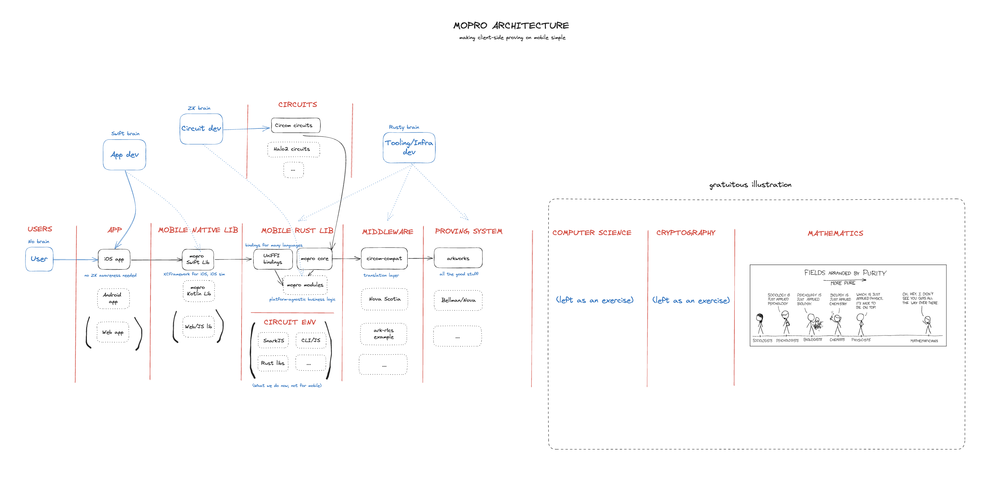

# mopro

Making client-side proving on mobile simple.

## Overview

This is a WIP.

- `mopro-core` - core mobile Rust library.
- `mopro-ffi` - wraps `mopro-core` and exposes UniFFI bindings.
- `mopro-ios` - iOS CocoaPod library exposing native Swift bindings.
- `mopro-example-app` - example iOS app using `mopro-ios`.

## Architecture

The following illustration shows how mopro and its components fit together into the wider ZKP ecosystem:



Zooming in a bit:


## Prepare

- Install [circom](https://docs.circom.io/) and [snarkjs](https://github.com/iden3/snarkjs)
- Install [cocoapods](https://cocoapods.org/)
- Run `./scripts/prepare.sh` to check all prerequisites are set.

## Build Bindings

To build bindings for iOS simulator debug mode, run

```sh
./scripts/build_ios.sh simulator debug
```

Open the `mopro-ios/MoproKit/Example/MoproKit.xcworkspace` in Xcode.

## Bindings

To update bindings, run `./scripts/update_bindings.sh simulator|device debug|release`.

- `simulator` is for building library to run on iOS simulator, `device` is for running on a real device
- `debug` is for Rust library to be in debug mode and `release` for release mode

## Acknowledgements

This work is sponsored by a joint grant from [PSE](https://pse.dev/) and [0xPARC](https://0xparc.org/).
