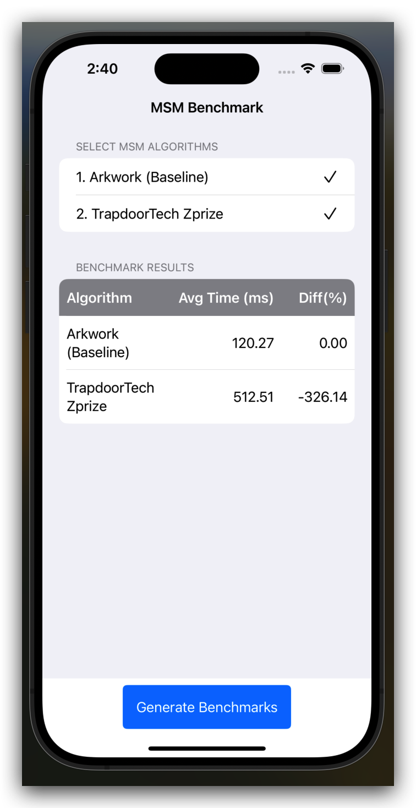

# ExampleGpuExploration

This the a example for GPU exploration and a test for benchmarking results.

## Documentation

See [here](https://github.com/zkmopro/mopro/blob/main/mopro-core/gpu_explorations/README.md)

## Usage

> please install `mopro-cli` by following the instructions [here](https://github.com/zkmopro/mopro/tree/main/mopro-cli)

### Prepare

`mopro prepare`

### Build

`mopro build --platform ios`

### Test

`mopro test`

The result would be shown as the following and in the folder `core/benchmarks/results/`

for example, in arkworks_pippenger_benchmark.txt:

```csv
msm_size,num_msm,avg_processing_time(ms)
8,5,55.204383199999995
8,10,28.0148833
12,5,824.3942917999999
12,10,1099.3523708
16,5,2787.8316663333335
16,10,2718.932094
```

### running Benchmarks on IOS devices
 
1. modify the deafult feature in the folder `mopro-ffi` in your `MOPRO_ROOT`
    * original: ~~`default=[]`~~ => `default=["gpu-benchmarks"]`
2. open the `ExampleApp.xcworkspace` in the `ios/` with Xcode on your Mac/ device
3. modify `mopro-config.toml` in the root directory:
    * ios_device_type = "simulator" to run on the simulator
    * ios_device_type = "device" to run on a iphone or a ipad
4. Build the project using `cmd + R`, your device will redirect to the app
5. Then, select the algorithms you want to run on your device, click `Generate Benchmarks`.

The result would be like:


