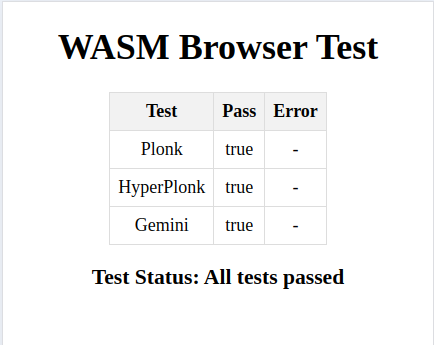

# Simple Web App with Wasm

## Preparations

Follow these steps only if there are changes in the `mopro-wasm` package. Otherwise, these steps are not required.

### Compile Halo2 Circuits to Wasm

This web test page requires three Wasm circuits: `halo2-plonk-fibonacci`, `halo2-hyperplonk-fibonacci`, and `halo2-gemini-fibonacci`.  
Refer to [`mopro-wasm/README.md`](../../mopro-wasm/README.md) for more details.

Use `wasm-pack` to generate halo2 wasm package for this testing web app with the following commands:

```bash
mopro-wasm $ wasm-pack build --target web --out-dir ../test-e2e/web/mopro-pkg  -- --all-features
```

### Copy Parameters

The generated Halo2 wasm package, **mopro-pkg**, requires a parameters folder, which is available in test-vectors/halo2. To set up the package correctly, copy the parameters folder into all files in the test directory as shown below:

```text
$ mkdir -p test-e2e/web/mopro-pkg/parameters/
$ cp test-vectors/halo2/* test-e2e/web/mopro-pkg/parameters/
```

## Test

This test suite uses chromedriver to run the application in a browser in headless mode. Both chrome and chromedriver are required.
Refer to the [mopro-wasm - Getting Start](../../mopro-wasm/README.md#getting-started) for installation and setup instructions.

1. Install dependencies

    ```bash
    yarn
    ```

2. Start a simple server by running the following command:

    ```bash
    yarn start
    ```

3. Test the application either manually or by using the test script:

   **Manually**:
   - Open your browser and navigate to: [http://localhost:3000](http://localhost:3000)
      
      

   **Using the test script**:
   - Run the following command:
     ```bash
     yarn test
     ```